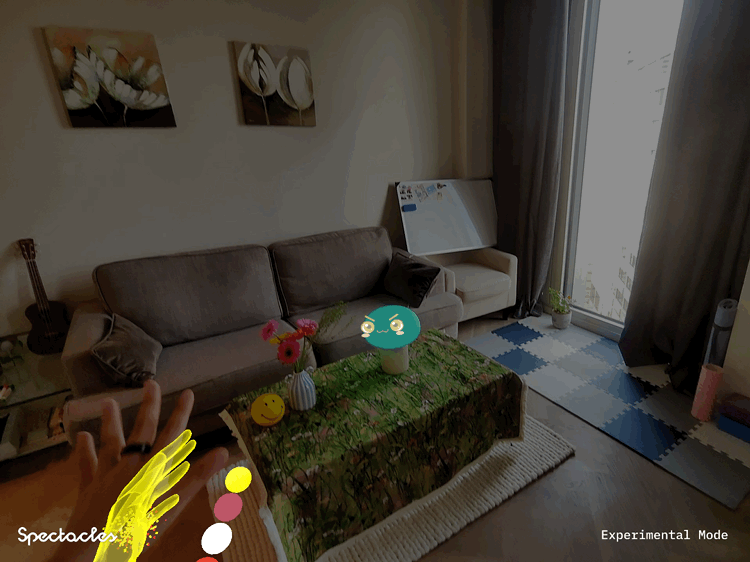
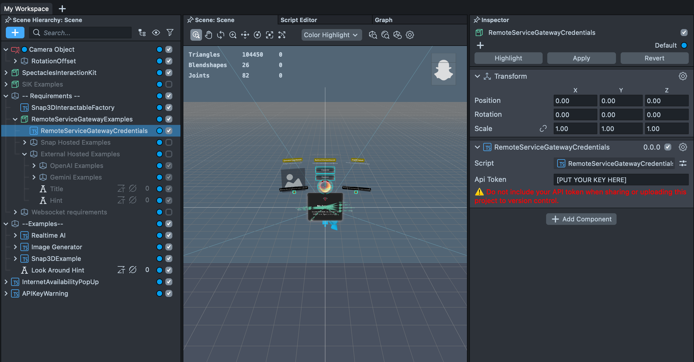
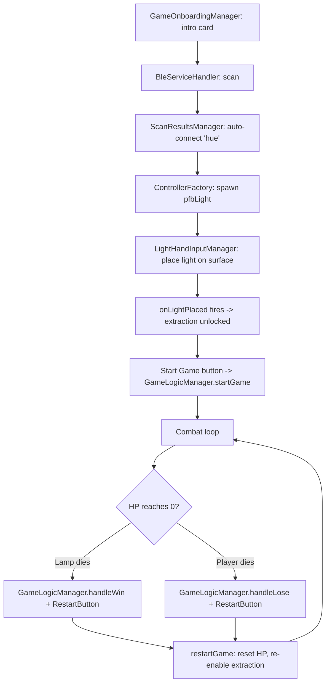
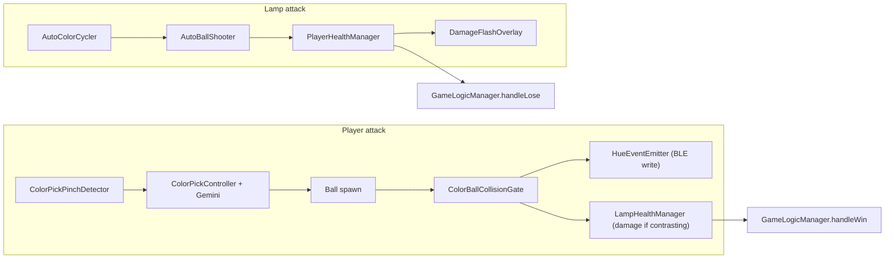

# Lumia Combat

[](https://developers.snap.com/spectacles/spectacles-frameworks/spectacles-interaction-kit/features/overview?) [](https://developers.snap.com/spectacles/about-spectacles-features/apis/experimental-apis?) [](https://developers.snap.com/spectacles/about-spectacles-features/compatibility-list) [](https://developers.snap.com/spectacles/about-spectacles-features/overview)

<!-- "Watch the demo" CTA links to the Lumia Combat promo video -->
<a href="https://drive.google.com/file/d/1o-x5i7CQ4uhdYuKIQobWNYZWIxg0KVQF/view?usp=drive_link"></a>


## Contents

- [Overview](#overview)
- [Why Open Source](#why-open-source)
- [Key Features](#key-features)
- [Key Mechanics / Player Actions](#key-mechanics--player-actions)
- [Setup](#setup)
- [Where to Set the Game Rules](#where-to-set-the-game-rules)
- [Key Scripts](#key-scripts)
- [Testing the Lens](#testing-the-lens)
- [Caveats](#caveats)
- [License](#license)
- [Contributing](#contributing)
- [Support](#support)
- [Disclaimers](#disclaimers)

## Overview

Lumia Combat is a kinetic game of color and light built with Snap Spectacles, BLE, and Philips Hue. Harvest colors from real objects in your room and put color theory to work: strike Lumia with the complementary color and defend by matching her hue. Every hit registers in the physical world, your actual bulb powers off the moment she's defeated.

## Why Open Source

Lumia Combat is shared as a reference for the Snap Spectacles community — not just a finished Lens, but a worked example of patterns that are otherwise hard to find:

- **It extends the BLE foundation into a real game.** Snap's [BLE Playground](https://github.com/specs-devs/samples/tree/main/BLE%20Playground) shows you how to scan, connect, and read a characteristic. Lumia Combat picks up where it leaves off — turning a peripheral into a *live game object* with health, a combat loop, and win/lose state, and documenting the unofficial Hue write quirks (half-range clamping, the byte > 127 crash) so others don't have to rediscover them.
- **It's a study in mixed-reality interaction design.** Pinch-and-hold to harvest a real color, arm-flip to reveal a wrist UI, hand-to-shatter defence, and look-to-target gating — all built on hand tracking and SIK. These can serve as reusable interaction recipes for other project ideas.
- **The physical world is the game.** The enemy is your actual Philips Hue bulb; hits recolor it and victory powers it off. It's a concrete blueprint for Lenses that reach out and change the room, not just the headset view.
- **It shows how to wire AI into gameplay.** Real-world color extraction and lamp placement run through Gemini via the Remote Service Gateway — a practical example of camera-frame + depth + LLM working inside a real-time loop.
- **It captures hard-won architecture lessons.** The singleton + `onRegistered` pattern for coordinating components that live on runtime-instantiated prefabs (via `ControllerFactory`) is a recurring Spectacles pain point this repo solves explicitly.
- **It's MIT-licensed and built to remix.** Every game rule is an Inspector `@input`, so designers can re-balance or re-theme without touching code — and improvements can flow back to the BLE Playground sample it builds on.

## Key Features

- **Color is the weapon.** Damage only lands when the thrown ball's hue *contrasts* with the lamp's current color; a *similar* hue lets you shatter incoming balls. The contrast/similarity rules live in [`GameLogicManager`](Assets/Scripts/GameLogicManager.ts) and are applied in [`LampHealthManager`](Assets/Scripts/PeripheralLight/LampHealthManager.ts).
- **Real-world color extraction.** Pinch-and-hold lets the player point at any object in the environment; the camera frame is cropped and sent to Gemini (via Remote Service Gateway) to extract the dominant color around the pinch. See [`ColorPickController`](Assets/Scripts/PeripheralLight/ColorPickController.ts).
- **A physical Philips Hue bulb is the enemy.** The same bulb that lights up the player's room is the in-game opponent: color writes go over BLE through [`HueEventEmitter`](Assets/Scripts/PeripheralLight/HueEventEmitter.ts), it recolors itself via [`AutoColorCycler`](Assets/Scripts/PeripheralLight/AutoColorCycler.ts), and it launches color balls **out of the bulb that arc toward the player's camera** — [`AutoBallShooter`](Assets/Scripts/PeripheralLight/AutoBallShooter.ts).
- **Left-wrist UI.** Flip your left hand to reveal a wrist panel with your **saved color history** (re-throwable by pinch), your **player health**, and a **complementary-color hint** — see [`ArmFlipPrefabSpawner`](Assets/Scripts/PeripheralLight/ArmFlipPrefabSpawner.ts), [`ColorHistoryBar`](Assets/Scripts/PeripheralLight/ColorHistoryBar.ts), and [`CircularHealthBar`](Assets/Scripts/PeripheralLight/CircularHealthBar.ts).
- **Rich combat visual feedback.** Tinted screen vignette on a hit ([`DamageFlashOverlay`](Assets/Scripts/PeripheralLight/DamageFlashOverlay.ts)), hand-contour color when you hold a defence color ([`HandVFXController`](Assets/Scripts/PeripheralLight/HandVFXController.ts)), and comet-trail balls ([`BallCometTrailController`](Assets/Scripts/PeripheralLight/BallCometTrailController.ts)).
- **Quick Test Mode.** Bypass all color-match checks via `GameLogicManager.quickTestMode` while iterating combat behavior.

## Key Mechanics / Player Actions

### Extract a color


Pinch and hold ~2 seconds ([`ColorPickPinchDetector.holdDuration`](Assets/Scripts/PeripheralLight/ColorPickPinchDetector.ts)) on a real-world color. The camera frame is cropped and sent to Gemini via Remote Service Gateway, which returns the dominant color around the pinch; it's saved to your wrist history ([`ColorPickController`](Assets/Scripts/PeripheralLight/ColorPickController.ts)).

### Attack


A ball grows in your hand, then your hand motion throws it. On lamp impact, [`ColorBallCollisionGate`](Assets/Scripts/PeripheralLight/ColorBallCollisionGate.ts) writes the new color to the bulb and damage is applied only if the hue contrast exceeds `GameLogicManager.contrastThreshold`. You can also pinch a saved swatch on your wrist to re-throw it ([`ColorHistoryBar`](Assets/Scripts/PeripheralLight/ColorHistoryBar.ts)).

### Lamp Retaliate



The lamp picks a random color every `intervalSecondsMin..Max` ([`AutoColorCycler`](Assets/Scripts/PeripheralLight/AutoColorCycler.ts)) and shortly after lobs a ball in a high arc from the bulb toward the player's camera ([`AutoBallShooter`](Assets/Scripts/PeripheralLight/AutoBallShooter.ts)).

### Defend


Either **dodge** the incoming ball physically, or **shatter** it: when the ball's color is similar enough to a color you're holding (`similarityThreshold`), bringing a hand within `touchRadius` shatters it and heals the player by `healPercentOnShatter`.

### Check your wrist


Flip your left hand to reveal the wrist UI ([`ArmFlipPrefabSpawner`](Assets/Scripts/PeripheralLight/ArmFlipPrefabSpawner.ts)): your saved color history, your current health, and a **complementary-color hint** — a VFX swatch ([`ColorHint.prefab`](Assets/Prefabs/ColorHint.prefab)) showing the hue opposite the lamp's current color (the one that will damage it), computed by [`GameLogicManager.getContrastingColor`](Assets/Scripts/GameLogicManager.ts) and refreshed each time the lamp recolors.

### Win / Lose / Restart


Lamp HP reaches 0 → [`LampHealthManager.onLampDied`](Assets/Scripts/PeripheralLight/LampHealthManager.ts) fires; player HP reaches 0 → [`PlayerHealthManager.onPlayerDied`](Assets/Scripts/PeripheralLight/PlayerHealthManager.ts) fires. Either outcome surfaces the restart button ([`RestartButtonController`](Assets/Scripts/PeripheralLight/RestartButtonController.ts)) which calls back into `GameLogicManager.restartGame()`.

## Setup

> **You must generate your own Remote Service Gateway token before this project will run.**
> Please note the `RemoteServiceGatewayCredentials` SceneObject is intentionally left blank. Without a valid token, Gemini-based color extraction, depth-based lamp detection will silently fail and [`APIKeyHint`](Assets/Scripts/Helpers/APIKeyHint.ts) will warn at startup. See step 4 below.

> **New to BLE on Spectacles?**
> Lumia Combat's BLE scan/connect/widget layer is built on top of Snap's open-source **BLE Playground** sample. For a deeper walkthrough of the BLE architecture, Hue pairing/reset procedure, and a GATT primer, see [BLE Playground](https://github.com/specs-devs/samples/tree/main/BLE%20Playground).

### Prerequisites

- **Lens Studio** v5.15.x (the designated release series for Spectacles)
- **Spectacles OS (Snap OS)** v5.64.396+
- **Spectacles App** iOS v0.64+ / Android v0.64+
- **Git LFS** (zip download will not work — large assets under `Assets/3D Art`, `Assets/Sound`, and `Assets/VFX` are LFS-tracked)
- A **Philips Hue color bulb** named `Hue color lamp` (the default) — or run in `isNoBleDebug` mode for editor-only iteration

Update guides: [Spectacles & app updates](https://support.spectacles.com/hc/en-us/articles/30214953982740-Updating) · [Download Lens Studio](https://ar.snap.com/download?lang=en-US)

### Steps

1. **Clone with Git LFS, on the `main` branch.** `main` is the official branch — make sure you're on it before opening the project (other branches are work-in-progress and may not run).

   ```bash
   git clone <this-repo-url>
   cd LumiaCombat
   git checkout main
   git lfs pull
   ```

2. **Open the project.** Open `LumiaCombat.esproj` in Lens Studio and let the import finish.

3. **Enable Experimental APIs + Extended Permissions on the headset.** Required for BLE, Gemini, camera frame access, and surface detection. See [Experimental APIs](https://developers.snap.com/spectacles/about-spectacles-features/apis/experimental-apis) and [Extended Permissions](https://developers.snap.com/spectacles/permission-privacy/extended-permissions).

4. **Generate and paste your RSG token.** *This is the step the repo cannot do for you — every contributor must do this once on a fresh clone.*

   1. In Lens Studio's Asset Browser, install the **Remote Service Gateway Token Generator** plug-in.
   2. Open `Window → Remote Service Gateway Token` and click **Generate Token**.
   3. Enable at least the **Gemini / Google** scope (required for [`ColorPickController`](Assets/Scripts/PeripheralLight/ColorPickController.ts) and the depth-based lamp finder in [`GeminiDepthLightEstimator`](Assets/Scripts/PeripheralLight/GeminiDepthLightEstimator.ts)). Enable **OpenAI** if you want the optional voice-prompt flow in [`LightAiInputManager`](Assets/Scripts/PeripheralLight/LightAiInputManager.ts).
   4. In the scene, select the `RemoteServiceGatewayCredentials` SceneObject in the Inspector and paste the token into its API Token field.

      

   5. **Do not commit your token.** It's a personal credential — keep `RemoteServiceGatewayCredentials` blank in any commits you push.

5. **(Optional) Editor / no-bulb mode.** On the `LensInitializer` SceneObject, set `isNoBleDebug = true` to fake BLE in the editor or on-device (you'll see ~30 synthetic scan results). On `GameLogicManager`, set `quickTestMode = true` to bypass color-match checks while iterating UI.

6. **Bulb prep (physical play only).** Keep the bulb on its default name `Hue color lamp` — the `"hue"` substring auto-connect filter in [`ScanResultsManager`](Assets/Scripts/Core/ScanResultsManager.ts) depends on it. If the bulb is already paired to a phone (e.g. the Hue app or nRF Connect), factory-reset it via the standard Hue power-cycle procedure documented in the [BLE Playground](https://github.com/specs-devs/samples/tree/main/BLE%20Playground) sample.

7. **Run it.**
   - **Editor:** press Preview. With `isNoBleDebug = true` you'll see a synthetic scan result list and the full UI flow without a real bulb.
   - **Device:** make sure the Hue bulb is powered on, then build/deploy to Spectacles, walk through onboarding → tap **Go Physical** → connect bulb → place lamp on a surface → press **Start Game**.

## Where to Set the Game Rules

**Every tunable game rule is exposed as an `@input` field on a component — either in `Assets/Scene.scene` or on one of the gameplay prefabs (e.g. `pfbLight`, `ColorHistoryBar.prefab`) that are instantiated at runtime.** Open the scene or the relevant prefab in Lens Studio and edit the Inspector — no code changes needed for balance. (Components hosted on runtime prefabs, such as `LampHealthManager`, `AutoColorCycler`, and `ColorHistoryBar`, are edited in the prefab, not the scene.)

| Category | Script | `@input` field(s) | Default |
|---|---|---|---|
| Color matching | [`GameLogicManager`](Assets/Scripts/GameLogicManager.ts) | `contrastThreshold` (hue distance required to damage the lamp) | `0.3` |
| Color matching | [`GameLogicManager`](Assets/Scripts/GameLogicManager.ts) | `similarityThreshold` (hue distance allowed for hand shatter) | `0.15` |
| Debug | [`GameLogicManager`](Assets/Scripts/GameLogicManager.ts) | `quickTestMode` (bypass all color filters) | `false` |
| Lamp HP | [`LampHealthManager`](Assets/Scripts/PeripheralLight/LampHealthManager.ts) | `maxHealth`, `damagePerHit` (%), `invincibilityDuration` (s), `lowHealthThreshold` (%) | `100`, `10`, `0.5`, `25` |
| Player HP | [`PlayerHealthManager`](Assets/Scripts/PeripheralLight/PlayerHealthManager.ts) | `maxHealth`, `damagePerHit` (%), `invincibilityDuration` (s), `healPerNeutralize` (%), `lowHealthThreshold` (%) | `100`, `10`, `0.5`, `5`, `25` |
| Lamp color cadence | [`AutoColorCycler`](Assets/Scripts/PeripheralLight/AutoColorCycler.ts) | `intervalSecondsMin`, `intervalSecondsMax`, `autoChangeEnabled` | `2`, `5`, `false` |
| Lamp ball physics | [`AutoBallShooter`](Assets/Scripts/PeripheralLight/AutoBallShooter.ts) | `delayThrowTime`, `arcHeightMin/Max`, `flightTimeMin/Max`, `ballScale`, `maxActiveBalls`, `shootingEnabled`, `overshootMultiplier` | `0.3`, `15`/`45`, `1.0`/`2.5`, `5`, `5`, `true`, `1.5` |
| Hand defence | [`AutoBallShooter`](Assets/Scripts/PeripheralLight/AutoBallShooter.ts) | `touchRadius` (cm), `healPercentOnShatter`, `shatterLifetimeSeconds`, `shatterEmissionBoost` | `6`, `5`, `2`, `2` |
| Player ball extraction | [`ColorPickController`](Assets/Scripts/PeripheralLight/ColorPickController.ts) | `growSpeed`, `finalBallSize`, `handVelocityMultiplier`, `baseThrowForce`, `centerCropScale`, `useLiteModel` | `1.0`, `3.0`, `0.3`, `800.0`, `0.3`, `false` |
| Pinch trigger | [`ColorPickPinchDetector`](Assets/Scripts/PeripheralLight/ColorPickPinchDetector.ts) | `holdDuration` (s), `useGracePeriod`, `gracePeriod` (s) | `2`, `true`, `0.3` |
| Damage feedback | [`DamageFlashOverlay`](Assets/Scripts/PeripheralLight/DamageFlashOverlay.ts) | `flashDuration` (s), `peakAlpha` | `0.5`, `0.5` |
| Onboarding tips | [`GameOnboardingManager`](Assets/Scripts/Core/GameOnboardingManager.ts) | `tipDurationSeconds`, `tipFadeDurationSeconds`, `autoStart`, `tips[]` | `10`, `0.4`, `true`, *(authored list)* |

### Constants that are *not* Inspector-tunable

Some values are intentionally hardcoded — change them in source if needed.

- The `0.7` "looking at light" dot-product threshold in [`LightHandInputManager`](Assets/Scripts/PeripheralLight/LightHandInputManager.ts).
- The `"hue"` auto-connect substring filter — defined as `HueLightData._commonDeviceNameSubstring` in [`PeripheralTypeData`](Assets/Scripts/Core/PeripheralTypeData.ts) and applied by [`ScanResultsManager`](Assets/Scripts/Core/ScanResultsManager.ts).
- The 5-slot color history count in [`ColorHistoryBar`](Assets/Scripts/PeripheralLight/ColorHistoryBar.ts) and [`ColorHistoryRing`](Assets/Scripts/PeripheralLight/ColorHistoryRing.ts).
- The `"Sphere"` SceneObject name expected by [`LampColliderSpawner`](Assets/Scripts/PeripheralLight/LampColliderSpawner.ts) (rename a finger ball and it stops registering hits).

## Key Scripts

The shortest path through the codebase, in the order a new contributor should read:

1. **[`GameLogicManager.ts`](Assets/Scripts/GameLogicManager.ts)** — combat rules (hue contrast/similarity), game start, win/lose/restart orchestration. Singleton; emits `onGameStarted`.
2. **BLE bootstrap** — [`LensInitializer`](Assets/Scripts/Core/LensInitializer.ts) → [`BleServiceHandler`](Assets/Scripts/Core/BleServiceHandler.ts) → [`ScanResultsManager`](Assets/Scripts/Core/ScanResultsManager.ts) → [`ControllerFactory`](Assets/Scripts/Core/ControllerFactory.ts). Discovers the bulb, instantiates `pfbLight` after GATT connect.
3. **Bulb control** — [`LightController`](Assets/Scripts/PeripheralLight/LightController.ts) (widget UI) + [`HueEventEmitter`](Assets/Scripts/PeripheralLight/HueEventEmitter.ts) (BLE writes: power, brightness, color).
4. **Player attack** — [`ColorPickPinchDetector`](Assets/Scripts/PeripheralLight/ColorPickPinchDetector.ts) → [`ColorPickController`](Assets/Scripts/PeripheralLight/ColorPickController.ts) (Gemini extract → grow → throw) → [`ColorBallCollisionGate`](Assets/Scripts/PeripheralLight/ColorBallCollisionGate.ts) (impact gate).
5. **Lamp attack** — [`AutoColorCycler`](Assets/Scripts/PeripheralLight/AutoColorCycler.ts) → [`AutoBallShooter`](Assets/Scripts/PeripheralLight/AutoBallShooter.ts) (arcing ball + hand-defence + heal).
6. **Health + death** — [`LampHealthManager`](Assets/Scripts/PeripheralLight/LampHealthManager.ts) and [`PlayerHealthManager`](Assets/Scripts/PeripheralLight/PlayerHealthManager.ts). Both singletons; expose `onHealthChanged`, `onLampDied`/`onPlayerDied`.
7. **Placement + onboarding** — [`LightHandInputManager`](Assets/Scripts/PeripheralLight/LightHandInputManager.ts) (fires `onLightPlaced` once per session) and [`GameOnboardingManager`](Assets/Scripts/Core/GameOnboardingManager.ts) (intro → BLE menu → tips roller).

### User flow



### Data flow



### Cross-cutting note: singletons

Nearly every gameplay coordinator (`GameLogicManager`, `LampHealthManager`, `PlayerHealthManager`, `AutoBallShooter`, `AutoColorCycler`, `ColorHistoryBar`, `ColorHistoryRing`, `RestartButtonController`, `LampFaceAnimator`, `GameOnboardingManager`) is a **singleton** with a `getInstance()` accessor and, where startup order matters, an `onRegistered` event. This is because the prefabs that host them (`pfbLight`, `LampOnboarding`, the color-history UI) are instantiated at runtime by [`ControllerFactory`](Assets/Scripts/Core/ControllerFactory.ts) and [`ArmFlipPrefabSpawner`](Assets/Scripts/PeripheralLight/ArmFlipPrefabSpawner.ts), so they cannot be wired via `@input` from a scene-root component. **Use the singleton pattern, not cross-prefab `@input`, when coordinating between these components.**

## Caveats

- **RSG token is mandatory.** Without it, color extraction, Gemini lamp detection, and any AI prompt flow silently fail. See Setup step 4.
- **Hue BLE is unofficial.** Brightness/color writes are clamped to roughly half range due to a known serialization bug in [`HueEventEmitter`](Assets/Scripts/PeripheralLight/HueEventEmitter.ts), and any byte >127 will crash the BLE stack. The script header comments are authoritative for the workarounds.
- **One app at a time.** The bulb must not be paired to another phone or app. If it is, factory-reset it via the standard Hue power-cycle procedure (the [BLE Playground](https://github.com/specs-devs/samples/tree/main/BLE%20Playground) sample documents this in full).
- **Auto-connect is name-based.** [`ScanResultsManager`](Assets/Scripts/Core/ScanResultsManager.ts) only auto-connects to devices whose advertised name contains `"hue"`. Rename your bulb back to default if you've customized it.
- **Color extraction is gated on placement.** Extraction stays off until `LightHandInputManager.onLightPlaced` fires the first time, so the `lightHandInputManager` field on [`GameLogicManager`](Assets/Scripts/GameLogicManager.ts) must be wired in the scene or the gate will never open.
- **Runtime prefab references.** Cross-prefab `@input` references to `AutoBallShooter`, `ColorHistoryBar`, `LampHealthManager`, etc. are unreliable because those scripts live on prefabs instantiated at runtime. Always go through the singleton + `onRegistered` event pattern.
- **Editor always fakes BLE.** Lens Studio's Preview panel fakes BLE regardless of `isNoBleDebug`. The real bulb-write code path is only exercised on-device.
- **Finger ball naming.** Finger balls must keep the SceneObject name `"Sphere"` or [`LampColliderSpawner`](Assets/Scripts/PeripheralLight/LampColliderSpawner.ts) won't register hits.
- **Singleton hygiene.** Multiple `GameLogicManager`, `LampHealthManager`, or `PlayerHealthManager` instances in the scene will print a warning and last-write-wins on the singleton — keep exactly one of each.

## Testing the Lens

### In Lens Studio editor

1. On the `LensInitializer` SceneObject, set `isNoBleDebug = true`. You'll get ~30 synthetic scan results so you can exercise the connect flow.
2. (Optional) On `GameLogicManager`, set `quickTestMode = true` to skip color matching while iterating UI.
3. Press Preview. UI, ball physics, and the win/lose/restart flow all work without a bulb.

### On Spectacles

1. Build and deploy to your Spectacles device — see the [Spectacles preview-panel guide](https://developers.snap.com/spectacles/get-started/start-building/preview-panel).
2. Power on your Hue bulb and make sure it's not paired to a phone (see Setup step 6 if it is).
3. Walk through onboarding → tap **Go Physical** → connect bulb → place lamp on a surface → press **Start Game**.

## License

Released under the MIT License — see [LICENSE](LICENSE). MIT is compatible with the public [BLE Playground](https://github.com/specs-devs/samples/tree/main/BLE%20Playground) sample this project is built on.

## Contributing

PRs and issues welcome. If you're working on the BLE foundation, please cross-reference the upstream [BLE Playground](https://github.com/specs-devs/samples/tree/main/BLE%20Playground) sample so improvements can flow both ways.

## Support

For Spectacles development questions, the [r/Spectacles](https://www.reddit.com/r/Spectacles/) community is the fastest place to get help.

## Disclaimers

- **Experimental APIs.** The Bluetooth, Gemini, camera-frame, and depth-cache APIs used here are experimental and subject to change. See [Experimental APIs](https://developers.snap.com/spectacles/about-spectacles-features/apis/experimental-apis).
- **Gemini usage.** Ensure compliance with [Google's Gemini API terms](https://ai.google.dev/gemini-api/terms) and [Spectacles' terms of service](https://www.snap.com/terms/spectacles).
- **Third-party references.** Hue/Philips/Polar names are property of their respective owners and are referenced here for educational/integration purposes only.
